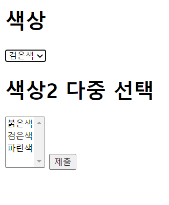
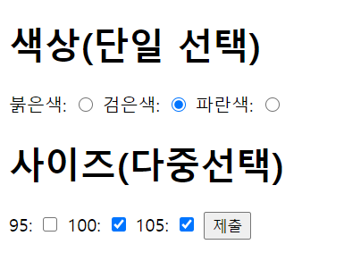
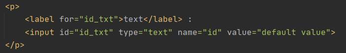

## What is front?

#### 웹을 향한 도전

    - 웹이 기본적으로 어떻게 굴러가는지 확실하게 몰라서 공부해보는 directory.
    - 일단은 front-end 부터 공부하기 시작.
    - HTML -> CSS -> JS 순으로 공부.
    - 어떤 방식으로 돌아가는지 학습이 된다면, back-end 공부 시작
    - 코딩테스트와 병행, 우선순위는 이게 우선.

#### 2020/12/27

- 왜 HTML이 나오게 되었는가?

- HTML의 기본 문법과 태그
    1. 속성과 태그에 대한 구분을 할 수 있게 되었다.
    2. 엄청나게 많은 태그가 있다는 것 또한 배웠다.
    
- 표 만들기(Table) 
    1. 과거에는 레이아웃으로 중요한 부분중 하나였을 것으로 짐작된다.
    2. 지금은 css와 js를 통하여 레이아웃을 설정하여, 그다지 중요성이 떨어진 부분이라 생각.
    

#### 2020/12/28

- 입력 양식에 대한 요소들
    1. input tag
        - <input type="???" value="!!!">
        - type을 통하여 어떤 모습으로 사용될지 정한다.
        - value를 통하여 보여지는 모습을 정할 수 있다. ex) "제출"
        
    2. select tag
    
        
        - select와 option tag를 사용하였다.
        - 체크박스 형식으로 선택할 수 있다.
        - 다중 선택은 ctrl을 누른 상태로 두개를 선택할 수 있다.
        
    3. radio & checkbox 속성
        
        
        - radio는 단일 선택을 주로 하는 button이다.
        - 색상의 단일선택처럼 하나의 주제에 대한 선택을 하기 위해서는 name을 같게 해주면 된다.
        - checkbox는 다중선택이 가능하게 하는 button이다.
        - 역시 name을 같게 설정하여 사용하면, 사진과 같이 한 주제로 나오게 된다.
        
    4. hidden tag
        
        - 화면에 보이진 않지만, 프로그래머가 서버에 전송할 데이터를 숨겨서 전송할 수 있도록 해주는 tag이다.

    5. label tag
    
        
        - label을 설정하고, 그에 맞는 id를 tag에서 사용하면 된다.
        - 이를 통해서 범위에 대한 집합(?)이 가능하다.

#### 2021/01/03

- CSS
    1. css는 HTML을 꾸며주기 위한 언어이다.
    2. 그러다보니 이렇다할 함수나 코드가 있다기보다는, 때에 맞게 속성을 찾아서 이용하는 게 효과적이라는 생각을 했다.
    3. CSS와 HTML에서는 코드 공부도 중요하지만, 사람들이 좋다고 느끼는 디자인을 배우는 것도 중요한 것 같다.